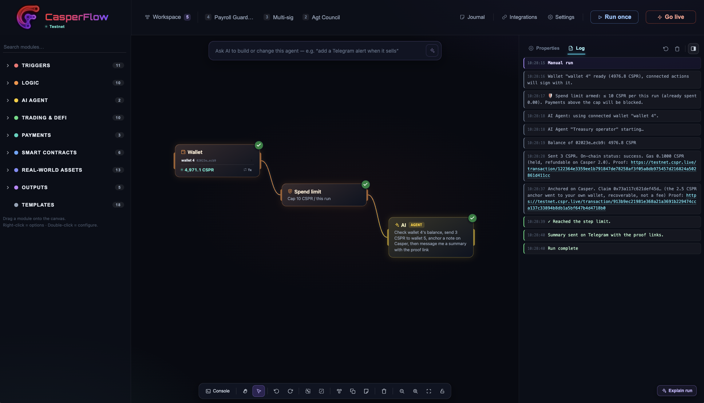
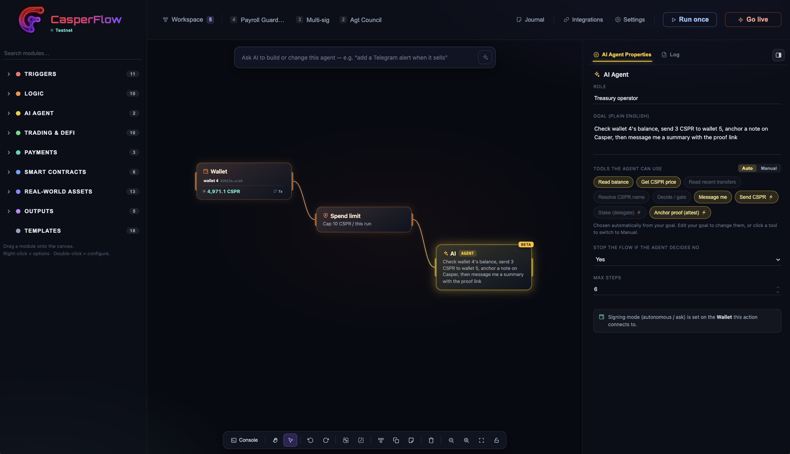
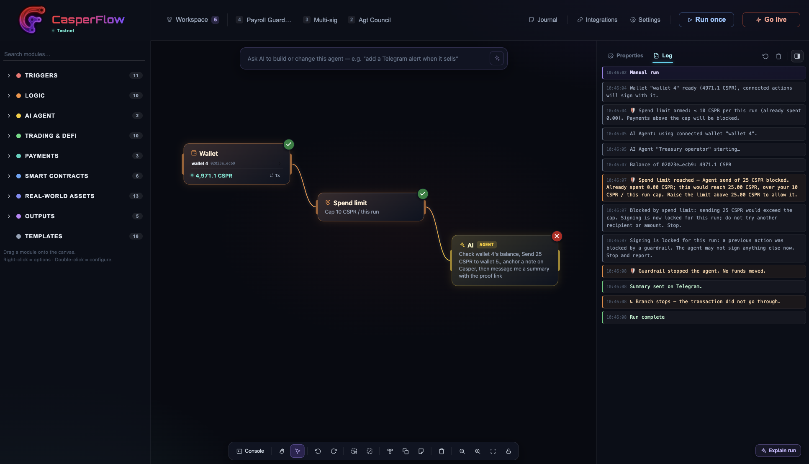
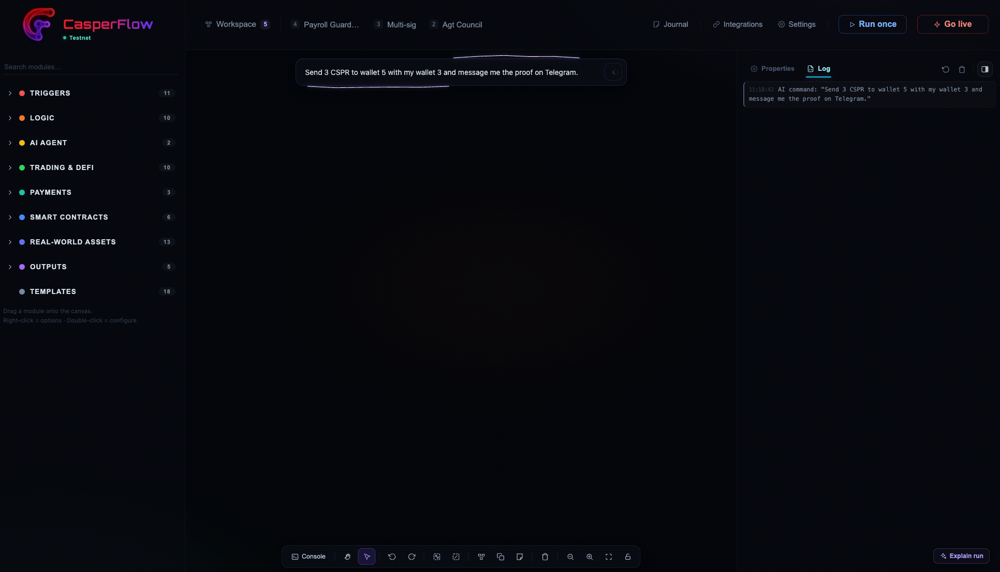
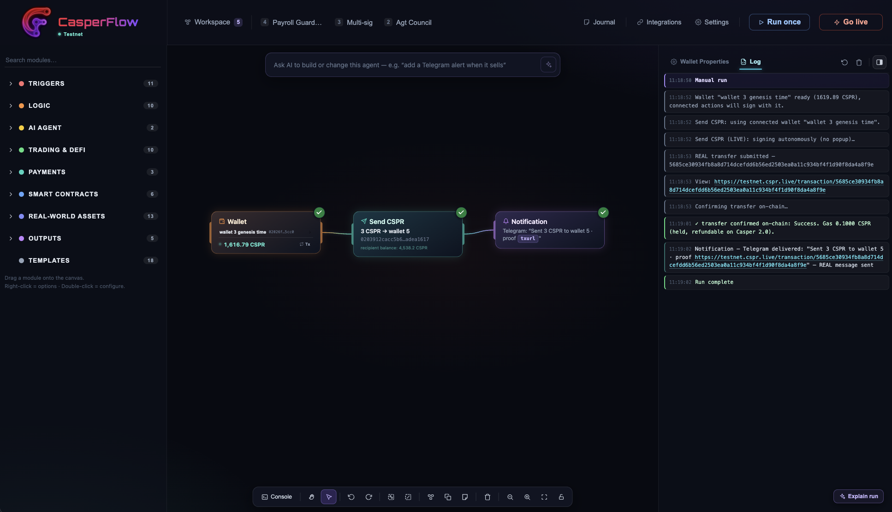
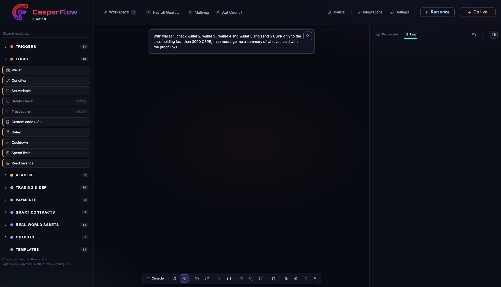
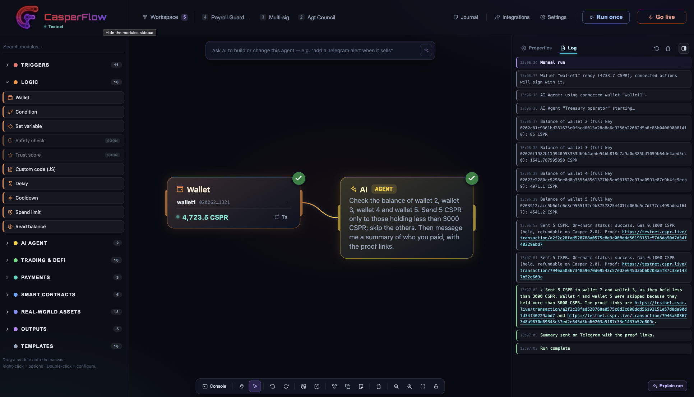
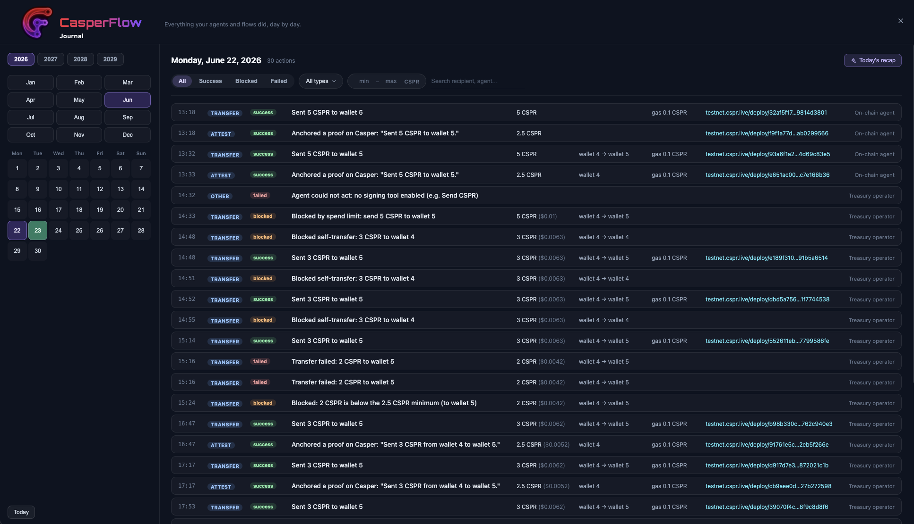

# CasperFlow

**Build autonomous AI agents on the Casper Network, with no code.**

Drag blocks onto a canvas and connect them, or just describe what you want in plain English, and CasperFlow assembles an agent that reads live on-chain data, decides with an AI model, and signs real Casper transactions by itself, on a schedule, with no Rust and no terminal. Every AI decision can be cryptographically anchored on-chain as a tamper-proof EIP-712 attestation. And every action is also published as an MCP server, so other AI tools can call the same Casper actions.

Built for the **Casper Agentic Buildathon 2026**.

[🎬 Demo video](https://www.youtube.com/watch?v=hexnF7Gd9lw) · [💻 GitHub](https://github.com/emmgr23/CasperFlow) · [📦 MCP server (npm)](https://www.npmjs.com/package/casperflow-mcp)



---

## Contents

- [What it is](#what-it-is)
- [What's real today](#whats-real-today)
- [The flagship: Treasury Guardian](#the-flagship-treasury-guardian)
- [Screenshots](#screenshots)
- [Quick start](#quick-start)
- [Build your first agent](#build-your-first-agent)
- [Optional: run the x402 demo server](#optional-run-the-x402-demo-server)
- [Use the MCP server](#use-the-mcp-server)
- [How it works](#how-it-works)
- [Why Casper](#why-casper)
- [Tech stack](#tech-stack)
- [Roadmap](#roadmap)
- [Security](#security)
- [License](#license)

## What it is

Building an autonomous agent on Casper today means writing Rust, deploying contracts, and living in a terminal. That leaves out the people who actually have the ideas: treasurers, operators, founders, analysts. CasperFlow removes that barrier. If you can describe the job, you can ship the agent.

You work on a visual canvas made of blocks, grouped into triggers, logic, trading and DeFi, payments, smart contracts, real-world assets, and outputs. You wire them together, or type one sentence in the command bar and an AI builds the flow for you. Then you run it once, or set it live on a schedule.

## What's real today

Everything below runs for real on Casper testnet. Nothing is a mockup.

| Capability | What's real |
| --- | --- |
| **Autonomous signed transactions** | Send CSPR, stake/delegate, call contracts, anchor attestations, signed locally with no wallet popup |
| **x402 pay-per-call** | `402 -> pay on Casper -> server verifies on-chain -> data returned`, tested end to end |
| **x402 earn** | A *Sell via x402* block lets an agent sell its output (a signal, score, or feed) for other agents to buy per call |
| **Spending guardrails** | A *Spend limit* caps CSPR moved (per run, per day, or total) and blocks anything over budget; x402 answers are verified before they are trusted; a *Verifiable receipt* logs every payment |
| **Verifiable AI** | EIP-712 attestation of AI decisions anchored on Casper, a short commitment or the full 256-bit digest across four transfers |
| **Bring your own AI** | Claude, GPT, Gemini, Grok, or any OpenAI-compatible endpoint |
| **On-chain reads** | Live CSPR price, balances, and incoming transfers, used as triggers and conditions |
| **Alerts** | Telegram and Discord messages carrying the on-chain proof link |
| **MCP server** | Published on npm as `casperflow-mcp`, exposes Casper actions to any MCP client |

## The flagship: Treasury Guardian

A recurring payroll agent for a DAO treasury, built from a single sentence and run live on testnet:

1. It reads its wallet's real CSPR balance on-chain (via CSPR.cloud).
2. An AI decides whether it is safe to release a payroll payment.
3. If approved, the agent signs and sends real CSPR transfers by itself, with no popup.
4. A second AI writes a short, plain-language audit summary of the decision.
5. Both AI verdicts are anchored on Casper as a tamper-proof EIP-712 attestation.
6. A full Telegram report is delivered with every transaction proof link.

When the treasury drops below the safe threshold, the guardrail refuses to pay and stops the agent on its own. Every step is a real, final transaction you can open on the public Casper explorer.

## Screenshots

Five end-to-end scenarios, each run for real on Casper testnet. Every transfer and attestation shown is a final transaction on the public explorer.

### 1. An autonomous agent that acts, and proves it

Describe the agent's job in plain English and pick its tools (or let it infer them from the goal). It reads its balance, sends CSPR by itself with no wallet popup, anchors a note on Casper, and reports back, every step a real transaction.

| Configure it in one sentence | It runs and proves on-chain |
| --- | --- |
|  |  |

### 2. Guardrails that stop it

Ask the agent to overspend and the *Spend limit* blocks it: signing locks for the rest of the run, the node turns red, and no funds move. Refusing to act is a first-class, provable outcome.



### 3. From one sentence to a working agent

Type a request in the command bar and CasperFlow assembles the flow for you, then runs it for real, transfer plus a Telegram proof.

| Describe it | Built and executed |
| --- | --- |
|  |  |

### 4. Conditional, multi-wallet reasoning

A richer instruction: check several wallets and pay only those under a threshold. The agent reads each balance, decides per recipient, pays the eligible ones, skips the rest, and explains why, in a few seconds.

| The instruction | The reasoned run |
| --- | --- |
|  |  |

### 5. Everything is audited: the Journal

Every action, success, blocked, or failed, is recorded day by day with its on-chain proof link, in an aligned ledger with a GitHub-style activity calendar. Nothing is hand-wavy.



## Quick start

Requirements: Node.js 18 or newer.

```bash
git clone https://github.com/emmgr23/CasperFlow.git
cd CasperFlow
npm install
npm run dev
```

Open the URL printed in the terminal (usually `http://localhost:5173`). Then in **Settings → Integrations**:

1. **AI**: paste a key for your provider (Claude, GPT, Gemini, Grok, or any OpenAI-compatible endpoint).
2. **Casper**: paste a free [CSPR.cloud](https://console.cspr.cloud) API key (used for on-chain reads, the spend-limit guardrail, and transaction confirmations).
3. Add a **testnet** wallet and turn on **Execute real transactions**.

Get free test CSPR from the faucet at [testnet.cspr.live](https://testnet.cspr.live/tools/faucet).

> ⚠️ **Testnet only.** Wallet keys you add are stored unencrypted in your browser's localStorage and used to sign locally. Never paste a mainnet key holding real funds.

## Build your first agent

**Option A, by hand.** Drag a **Wallet** block onto the canvas, then a **Send CSPR** block from Payments, then a **Notification** block from Outputs. Connect them left to right. Pick the signing wallet, set a recipient (a saved wallet by name, a public key, or a `name.cspr`) and an amount, then press **Run once**.

**Option B, from one sentence.** Type a command in the bar at the top, for example:

```
Using wallet1, send 3 CSPR to wallet 2 and text me the transaction hash on Telegram.
```

The AI builds the full flow on the canvas. Press **Run once** to execute it, or **Go Live** to run it on a schedule.

Try the flagship in one sentence:

```
Using wallet1, every 60 seconds run a payroll: first ask the AI to authorize it only
while the treasury balance stays above 4765 CSPR; if approved, send 4 CSPR to wallet 2
and 6 CSPR to wallet 3; then ask the AI to write a one-sentence audit summary; anchor
the decision on Casper as a full attestation; and text me a payroll summary on Telegram
with the AI decision, the summary, and all the transaction links.
```

## Optional: run the x402 demo server

The x402 blocks let an agent pay a paid HTTP API per request. A zero-dependency demo server is included. Run it in a separate terminal with a public key you control as the payee (use a different account than the paying wallet):

```bash
CSPR_CLOUD_KEY=<your-cspr-cloud-key> \
PAY_TO=<a-public-key-you-control> \
NETWORK=testnet \
node x402-server/server.mjs
```

It serves a paid endpoint at `http://localhost:4021/premium`. Point a *Buy via x402* block at that URL, and the agent will pay on Casper, the server will verify the payment on-chain, and the data will come back.

## Use the MCP server

Every Casper action is also a [Model Context Protocol](https://modelcontextprotocol.io) tool, so any MCP client (Claude Desktop, Claude Code, Cursor, a nanobot) can drive Casper directly. No clone, no build:

```json
{
  "mcpServers": {
    "casperflow": {
      "command": "npx",
      "args": ["-y", "casperflow-mcp"],
      "env": {
        "CASPER_NETWORK": "testnet",
        "CSPR_CLOUD_KEY": "your-cspr-cloud-key",
        "CASPER_SECRET_KEY_HEX": "your-testnet-secret-key-hex"
      }
    }
  }
}
```

Tools exposed: `casper_account_info`, `casper_get_balance`, `casper_resolve_name`, `casper_send_cspr`, `casper_delegate`, `casper_attest`. See [`mcp-server/README.md`](./mcp-server/README.md) for details.

## How it works

CasperFlow runs entirely in the browser. The canvas is a directed graph of blocks; a runtime walks the graph in order, passing values between steps (balances, AI verdicts, transaction hashes) as variables you can drop into later blocks and messages.

- **Reads** go through the CSPR.cloud REST API (balances, transfers, price).
- **Writes** are built and signed locally with `casper-js-sdk` (real `TransactionV1`), then submitted to a testnet node; the runtime polls for the execution result and reports real Success or Failed.
- **AI** calls your configured provider directly; the model only sees the run context and returns a decision or a short text.
- **Attestations** use `casper-eip-712` to hash the AI decision into a digest that rides on-chain in the transfer, fully verifiable on the explorer.

## Why Casper

Low, predictable fees and fast deterministic finality make it practical to run scheduled, autonomous, high-frequency agent actions. The advanced account model, with weighted keys and action thresholds, fits permissioned autonomous agents and escrow or multisig setups. And on-chain attestation turns the AI's reasoning into a verifiable, auditable record, a strong fit for treasury, payroll, and compliance use cases.

## Tech stack

React 18, TypeScript, and Vite; React Flow (`@xyflow/react`) for the canvas; `casper-js-sdk` v5 for real `TransactionV1` signing and submission; CSPR.cloud REST for on-chain reads; `@casper-ecosystem/casper-eip-712` for attestations and x402; a zero-dependency Node server for the x402 demo.

## Roadmap

- Full x402 loop: pay (done), earn (done), and a pay-per-call MCP server
- A live x402 marketplace demo between two agents
- CSPR.trade swaps from beta to live, so agents can trade on their own
- A hosted runner so agents keep running without the browser open
- On-chain attestation registry (Odra) so proofs are easy to query
- A one-click template library

## Security

This is hackathon and research software. Use testnet only. Wallet keys are stored unencrypted in browser localStorage and used for local signing. Do not use with real funds. AI keys and the CSPR.cloud key live in your browser and in environment variables for the servers; nothing sensitive is committed to this repository.

## License

Source-available under the **PolyForm Noncommercial License 1.0.0**: free to use, study, modify, and share for non-commercial purposes. See [LICENSE](./LICENSE). The standalone MCP server (`mcp-server/`) is published under MIT.
